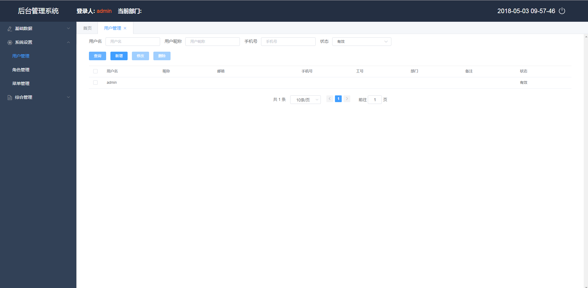
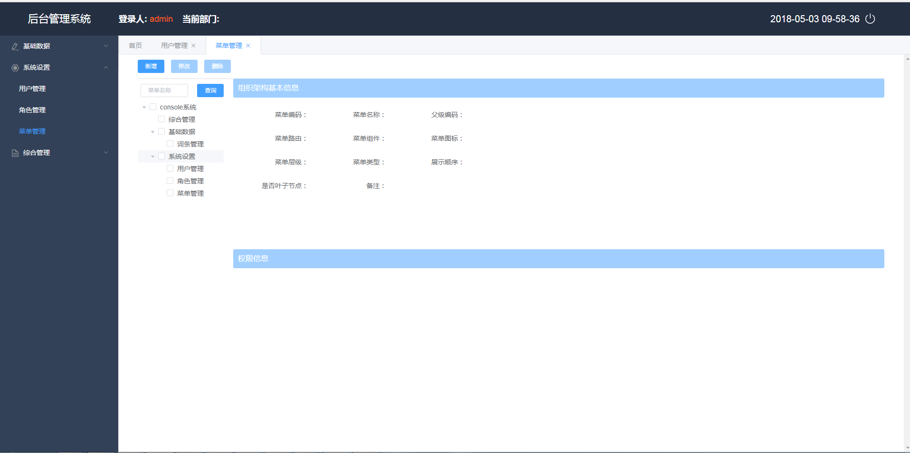

### ifarm 后台管理系统
##### 简介
1. ifarm 后台管理系统，采用前后端分离设计与开发，本工程为后端Java代码，前端采用Vue+ElementUI开发,
工程地址[ifarm-console](https://github.com/lhrimperial/farm-console);
2. 后端技术栈
    - SpringBoot
    - SpringMVC
    - MyBatis + MySQL
    - Redis
    - Shiro
3. 项目中抽象了SpringBoot整合常用的后端框架的[framework](https://github.com/lhrimperial/framework), 采用Shiro作用权限管理框架，设计了细粒度的权限控制
4. 用户/密码：admin/123     
4. 效果图
    - 用户管理
    
    - 菜单管理
    